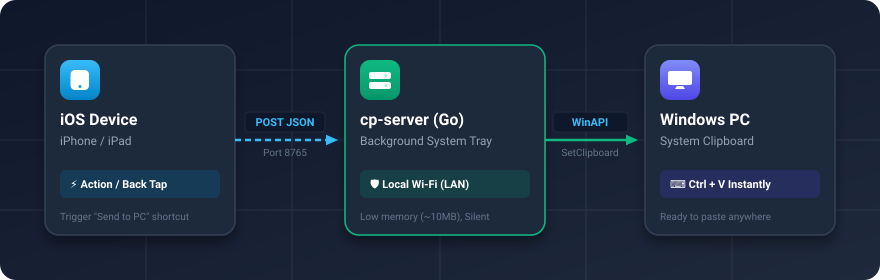

<div align="center">

# 📋 cp-server

**Instantly sync text from iOS to your Windows system clipboard over your local Wi-Fi.**  
*Copy on iPhone, `Ctrl + V` on Windows PC.*

[](LICENSE)
[](#)
[](https://golang.org)
[](#)

<br/>

<p align="center">
  
</p>

</div>

---

## ✨ Features

- 🚀 **Zero Cloud Dependency**: Works 100% locally on your home Wi-Fi (LAN). Fast and private.
- 🪟 **Silent & Background Native**: Runs in the Windows System Tray with **no pop-up console window**.
- 🔄 **One-Click Startup Toggle**: Enable or disable "Run on Windows Startup" directly from the system tray icon menu.
- ⚡ **Lightweight**: Pure Go binary consuming under ~10MB of RAM.
- 📱 **iOS Shortcuts Integration**: One tap via Action Button, Back Tap, Share Sheet, or Widget.

---

## 📥 Quick Start (No Go Required!)

You do **not** need to install Go to use this tool.

1. Go to the [**Releases**](../../releases) page.
2. Download the latest `cp-server-windows-amd64.zip` (or `.exe`).
3. Extract and double-click `cp-server-bg.exe`:
   - It will run silently in your **Windows System Tray** (look for the icon in the bottom-right taskbar `^`).
4. *(Optional)* Right-click the tray icon and check **"Start with Windows"** to make it run automatically on boot.

> [!NOTE]
> **First-time Windows SmartScreen Warning:**  
> If Windows displays *"Windows protected your PC"* when opening the newly downloaded `.exe`, click **More info** ➔ **Run anyway**. (This occurs because the executable is not signed with an expensive corporate certificate).

---

## 📱 iOS Shortcut Setup

Set up a shortcut on your iPhone or iPad in 1 minute:

1. Open the **Shortcuts** app on iOS.
2. Create a new shortcut named **"Send to PC"**.
3. Add the following 2 actions:
   - **Action 1: Get Clipboard**
   - **Action 2: Get Contents of URL**
     - **URL**: `http://<YOUR_PC_LOCAL_IP>:8765/clipboard` *(e.g. `http://192.168.1.100:8765/clipboard`)*
     - **Method**: `POST`
     - **Headers**:
       - `Content-Type`: `application/json`
     - **Request Body**: `JSON`
       - Key: `text` | Type: `Text` | Value: Select **Clipboard**
4. Save the Shortcut!

> [!TIP]
> **Pro Tip for iOS:** Bind this shortcut to **Action Button** (iPhone 15 Pro+) or **Back Tap** (*Settings > Accessibility > Touch > Back Tap*) for instant one-gesture syncing!

### Finding Your PC's Local IP
In PowerShell / Command Prompt on your PC, run:
```powershell
ipconfig
```
Look for `IPv4 Address` under your active Wi-Fi or Ethernet adapter (usually starts with `192.168.x.x` or `10.x.x.x`).

---

## 🔌 API Endpoints

The server listens by default on port `8765`:

| Method | Endpoint | Description | Payload Example |
|---|---|---|---|
| `POST` | `/clipboard` | Sets the Windows clipboard content | `{"text": "Hello PC"}` |
| `GET` | `/clipboard` | Reads current Windows clipboard text | — |
| `GET` | `/health` | Health check and server status | — |

### Test from PowerShell
```powershell
# Send text to PC clipboard:
Invoke-RestMethod -Uri "http://localhost:8765/clipboard" -Method Post -ContentType "application/json" -Body '{"text": "Hello from Terminal!"}'

# Read text currently on PC clipboard:
Invoke-RestMethod -Uri "http://localhost:8765/clipboard" -Method Get
```

---

## 🛠️ Build from Source (For Developers)

If you have [Go](https://go.dev/) installed and want to compile or customize the source:

```powershell
# 1. Clone the repository
git clone https://github.com/yourusername/cp-server.git
cd cp-server

# 2. (Optional) Compile Windows Icon into syso
go run github.com/akavel/rsrc@latest -ico icon.ico -o rsrc.syso

# 3. Build headless binary (silent without console window)
go build -ldflags "-H=windowsgui -s -w" -o cp-server-bg.exe main.go

# 4. Or build standard console version (with logs)
go build -o cp-server.exe main.go
```

### Custom Port / Binding
```powershell
.\cp-server.exe -port 9000 -bind 0.0.0.0
```

---

## 🔒 Security Notice

This application is designed specifically for **local home network (LAN / Wi-Fi)** convenience without authentication overhead.  
**Do not** expose port `8765` directly to the public internet (avoid router port forwarding) to ensure your clipboard remains private.

---

## 📄 License

This project is licensed under the [MIT License](LICENSE).
